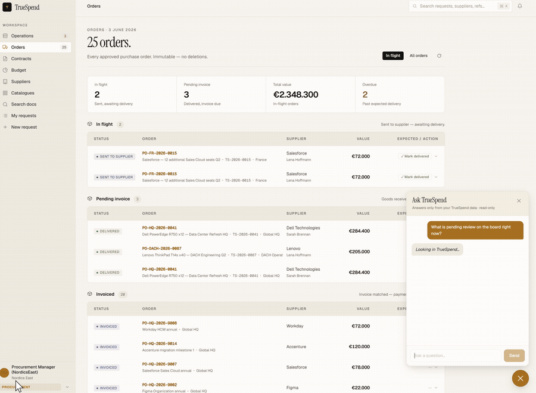

# TrueSpend

<p align="center">
  
  
  
  
  
  
  
  
  
  
  
  
  
  
</p>

<p align="center">
  <strong>Procurement doesn't need to be faster. It needs to not exist.</strong>
</p>

<p align="center">
  
</p>

<p align="center">
  
  <br />
  <em>Live walkthrough · </em><a href="demo/truespend-demo.mp4"><strong>watch in full resolution ▸</strong></a>
</p>

---

> *"Three things need you this week. Everything else, the agent closed."*

---

## What this is

TrueSpend is an AI-native procurement operating system built for mid-size companies that spend €5M–€200M/year on software, hardware, cloud, and services — and can't afford a 15-person procurement team, a €300k consulting retainer, or a seven-figure ERP implementation to manage it.

It replaces manual approval chains, spreadsheet budget tracking, license chaos, and vendor negotiation theatre with a reasoning agent that acts on everything it's confident about and surfaces only the decisions that genuinely need a human.

The interface is one board. It shows what needs you. The agent is silent on everything else.

---

## The problems it solves

**The contract expiry spreadsheet**
A €3M renewal gets noticed 28 days out. No brief exists. The vendor account team has been preparing for six months. You walk into the negotiation blind. TrueSpend watches every contract from 18 months out, extracts every clause, calculates the real TCO, builds the negotiating position, and has the brief ready before you need it.

**The license black box**
You pay for 500 Salesforce seats. 140 are assigned to users who haven't logged in for 90 days. The vendor knows this. It's in the true-up calculation they'll present at renewal. You don't. TrueSpend tracks every seat, every assignment, every login — and tells you the exact negotiating position before the vendor does.

**The bundle trap**
Microsoft sells you E5 at €54/user/month. You use Teams, Exchange, and Defender. That's E3 + Defender add-on = €38. At 3,000 seats that's €576k/year for features nobody opens. TrueSpend decomposes every bundle into components, measures actual usage depth, and builds the counter-offer automatically.

**The cost center pocket game**
DACH IT has €180k left in Q4. They know if they don't spend it, next year's baseline gets cut. So they buy software nobody needs. Meanwhile France is in overrun on SaaS. Nobody has the full picture. TrueSpend centralizes budget visibility, detects out-of-cycle spend patterns, flags cross-branch duplicate tools, and kills the game before it's played.

**The LLM shadow spend problem**
Six teams. Four OpenAI keys. Azure OpenAI buried in the EA. GitHub Copilot approved. Cursor expensed. AWS Bedrock in the cloud bill. The combined bill arrives. Nobody owns it. TrueSpend registers every API key, tracks daily token consumption per team, allocates it to the right budget, and recommends consolidation before the spend happens.

**The hardware depreciation black hole**
Machines are replaced on calendar (3 years) regardless of condition or warranty. The laptop that's been in a drawer for 8 months still has a Microsoft 365 seat assigned. The server warranty expired 6 months ago and there's no coverage on the failure last week. TrueSpend runs full depreciation, tracks warranty status, detects zombie licenses on decommissioned hardware, and triggers replacement via the P2I workflow when the economics say to — not the calendar.

**The approval that takes two weeks for a €400 tool**
Developer needs Figma. Submits to IT. IT emails procurement. Procurement asks for justification. Finance checks budget. Manager approves. Two weeks later: approved. Developer has been on the card since day two. TrueSpend receives the Jira ticket, checks the license entitlement register (is Figma already available?), checks the budget bucket, checks manager authority, and either provisions the seat or routes a one-touch decision to the board. Same day.

---

## How the reasoning works

Every transaction runs five signals simultaneously:

```
Signal 1 — Contract context
  Not just "does a contract exist" but: pricing at this volume tier,
  notice clauses being triggered, auto-escalation terms, true-up exposure.

Signal 2 — Budget context
  Three-tier check: category bucket available? Branch annual headroom > 80%?
  Within manager's delegated authority?

Signal 3 — Supplier context
  Performing within SLA. Open disputes. Compliance status. Strategic tier.

Signal 4 — Request context
  Normal for this requester and role. Quantity makes sense. Known project.
  Duplicate capability already exists elsewhere in the org?

Signal 5 — Policy context
  Delegated authority at this spend level. Category holds or freezes.
  Special rules for this vendor or contract type.
```

Output:

```
All signals green, high confidence  →  Agent acts. Logs reasoning. Done.
One signal uncertain                →  One-touch ticket on Operations Board.
≥€100k or compliance blocker        →  Jira escalation with full brief.
```

Every decision is stored with full reasoning. Not just the output — why.

---

## What it covers

| Domain | Capability |
|--------|-----------|
| **Contract management** | Expiry tracking (90/60/30 day), clause extraction, TCO calculation, escalation clause detection, lock-in scoring, auto-renew or reason, walk-away position generation |
| **P2I — Purchase to Invoice** | Intake → 3-tier budget check → PO generation → delivery confirmation → 3-way invoice match → payment instruction → ERP sync queue |
| **Budget centralization** | Budget buckets (plan), running positions (committed/spent), pool reserves, reallocation audit trail, Q4 flush detection, cross-branch duplicate surfacing |
| **License intelligence** | Entitlement register, seat assignment, shelfware detection, true-up risk, bundle decomposition, Jira self-service with same-day provisioning |
| **Asset lifecycle** | Hardware register, depreciation engine (straight-line, declining balance), warranty tracking, end-of-life assessment, replacement via P2I, disposal audit trail |
| **Hyperscaler FinOps** | AWS/GCP/Azure daily burn vs commitment, overshoot/undershoot alerts, idle resource detection, reservation optimization |
| **LLM consumption** | API key register, daily token tracking per team/model, consolidation intelligence, model routing recommendations, budget allocation to cost centers |
| **Supplier compliance** | 4-agent onboarding (Lawyer/NDA, GDPR/DPA, InfoSec/TOMs, LkSG/Ethics), Art. 28 GDPR DPA generation, German Supply Chain Act, e-signature workflow |
| **Vendor pricing intelligence** | Market benchmark database, walk-away calculator, competitor pricing, bundle decomposition, negotiation brief generation |

---

## Technology stack

| Layer | Technology |
|-------|-----------|
| Orchestration | n8n (self-hosted) |
| AI reasoning | Claude Sonnet 4.6 via Anthropic API |
| Database | PostgreSQL (Railway) |
| REST API | PostgREST (Railway) |
| Operations Board | React + Vite + Tailwind → nginx → Railway |
| Observability | Grafana (Railway) |
| Escalations | Jira (PROC project, ≥€100k only) |
| Email | IMAP (inbound) + SMTP (outbound) |

No Slack. One clean Operations Board. The agent is silent on everything it handles.

---

## Workflows (17)

| File | Trigger | Function |
|------|---------|----------|
| `intake_receiver.json` | Webhook (UI or Jira) | 5-signal reasoning → auto / one-touch / escalate |
| `chat_assistant.json` | Webhook (`/chat`) | Ask assistant — scope gate → pre-fetched DB bundle → Claude (read-only, data-only) |
| `board_action.json` | Webhook (`/board-action`) | Server-side money/budget/user writes off the browser token (privileged JWT) |
| `supplier_reply_handler.json` | IMAP | Reads supplier email → schema-validated guard → queues a draft to the board (no model-authored auto-send) |
| `docusign_sign.json` | Webhook (Sign button) | DocuSign JWT Grant → embedded signing URL |
| `docusign_callback.json` | DocuSign event | Envelope signed → ticket approved, legal doc updated |
| `contract_watcher.json` | Daily 07:00 | Expiring contracts → auto-renew or agent brief |
| `reorder_trigger.json` | Daily | Reorder candidates → place order or escalate |
| `hyperscaler_monitor.json` | Daily 06:00 | Cloud positions → anomaly + overspend alerts |
| `supplier_onboarding.json` | Webhook | 4 parallel compliance agents → docs + board ticket |
| `invoice_processor.json` | IMAP | Parse invoice → 3-way match → payment instruction → ERP queue |
| `delivery_confirmation.json` | Webhook | `confirm_delivery` RPC → PO delivered, SLA check |
| `asset_depreciation.json` | Monthly 1st 06:00 | Depreciation engine → warranty alerts → replacement tickets |
| `llm_consumption.json` | Daily 06:30 | AI spend tracking per team/model → anomaly tickets |
| `rag_embedder.json` | Every 6h | Legal docs → OpenAI embeddings → `document_embeddings` |
| `dispatch_drain.json` | Scheduled | Drains the `dispatch_queue` outbox → email / ERP / Slack via SECURITY DEFINER RPCs |
| `vps_monitor.json` | Scheduled | VPS health → alert ticket on anomaly |

All workflows: 120s timeout, 3× retry, full `trace_log` per signal. Status transitions call SECURITY DEFINER RPCs — no workflow writes `tickets.status` directly.

---

## Database schema (v2.0)

Canonical source: the ordered migration chain in [`db/migrations/`](db/migrations) (run via [dbmate](docs/decisions/ADR-007-dbmate-and-generated-schema.md)). [`db/schema.sql`](db/schema.sql) is a generated snapshot.

**32 tables across 10 domains:**

```
Organization    branches · cost_centers · users
Suppliers       suppliers · legal_documents · compliance_checks
Contracts       contracts · contract_changes · contract_clauses
Budget          budget_buckets · budget_positions · budget_pools · budget_reallocations
P2I             purchase_orders · po_sequences · invoices · payment_instructions · erp_sync_queue
Assets          assets · asset_depreciation_log
Licenses        license_entitlements · license_assignments
Consumption     hyperscaler_positions · llm_api_keys · llm_consumption
Operations      tickets · decisions · trace_log · supplier_emails
Intelligence    vendor_pricing_benchmarks · trust_settings
```

**Views (live in production):**
`open_tickets_board` · `purchase_orders_board` · `catalog_by_supplier` · `contracts_expiring` · `po_analytics` · `invoice_analytics` · `spend_trend` · `savings_tracking` · `supplier_performance` · `approval_velocity`

---

## Operations Board — 6 screens

The single human interface. No Slack. No email. No dashboards to check unless you want to.

| Screen | What it does |
|--------|-------------|
| **Operations** | Live approval queue — `signature_required` → `pending_review` → `escalated` → `pending_confirm`. Auto-refresh 30s. Approve / Reject / Sign / Acknowledge. |
| **Orders** | Every purchase order. In flight (sent/acknowledged), Pending invoice (delivered), Closed. Click to expand: requester, ticket ref, Jira badge for ≥€100k. |
| **Suppliers** | 17 vendors with health signal, compliance status, onboarding stats. "Onboard supplier" triggers 4-agent parallel assessment (Lawyer · GDPR · InfoSec · LkSG/Ethics) with live progress. |
| **Catalogues** | Pre-negotiated items per supplier (Apple, Dell, Lenovo, Microsoft 365, Salesforce, AWS, Google Cloud). Live from DB. Add to cart → single order ticket. |
| **My Requests** | Personal request history. Click to expand: what was ordered, approval trail, pipeline step tracker showing exactly where a request is stuck. |
| **New Request** | Ad-hoc purchase · Contract renewal · Supplier onboarding · Other. Routes to n8n intake webhook → agent reasoning. |

**Analytics sidebar:** Grafana dashboards for Vendor Intel · Budgets · Contracts · Expiring · PO Status — all tagged and live.

Approve / Reject / Confirm / Close call SECURITY DEFINER RPCs via PostgREST (`/rpc/*`). Read/display operations PATCH PostgREST directly. No backend API layer needed.

---

## Budget model

```
CFO sets annual plan (budget_buckets)
         ↓
Controlling approves — distributed to cost centers
         ↓
Every PO approved → budget_positions.committed += amount (immediate)
Every invoice paid → committed released, spent incremented
         ↓
Pool reserve (budget_pools) — CFO lever, drawn by exception only
         ↓
Every budget move → budget_reallocations (full audit trail, immutable)
```

Three-tier approval check on every request:
1. **Category bucket** — `branch × category × quarter` headroom?
2. **Branch annual** — running above 80% YTD?
3. **Manager authority** — within `users.spend_authority` for this category?

---

## Security model

**Database layer (enforced at the PostgreSQL level — not client-side):**

```
PostgREST connects as truespend_app (NOSUPERUSER, NOBYPASSRLS)
  ↓
GRANT/REVOKE is real — no superuser bypass
  ↓
tickets.status — no UPDATE grant to truespend_app
PATCH /tickets {status: "approved"} → 403 Forbidden
  ↓
Status transitions ONLY through SECURITY DEFINER RPCs:
  approve_and_commit   → sets approved + creates PO + commits budget (atomic)
  reject_ticket        → releases committed budget + sets rejected
  close_ticket         → sets closed (ack path)
  confirm_delivery     → sets delivered + SLA check + supplier health flag
  match_invoice        → 3-way match logic
  create_payment_instruction → records spend + ERP sync queue entry
```

**Agent layer (LLM advises, deterministic code decides):**

```
Inbound email / invoice → Claude (extracts + recommends, never acts)
  ↓
Deterministic guard (strict schema + action allowlist; workflows/lib/*_guard.js)
  ↓  model output is validated, never trusted:
related_ticket_id / po_id  → DERIVED from thread headers / PO number, not the model
supplier replies           → queued to the board (pending_review); no model-authored auto-send
invoice match              → match_invoice RPC is the authoritative money gate, not the model
  ↓
Repro-proven: workflows/__tests__/phase1_repro.test.js (injection inert after the guard)
```

**Pre-commit hook** (`scripts/quality-gate.sh`): blocks hardcoded JWTs, private keys, and Bearer tokens in workflow headers; verifies migration ordering, workflow-guard sync, and that no prod URL / placeholder sender is hardcoded. 44 checks, must be green before every push.

**Money-RPC fail-closed path**: every money RPC checks the JWT `app_role` claim. Today the static browser token carries no claim (the guard is dormant); the hardening flips it fail-closed and moves money writes off the browser onto a server-side n8n path ([ADR-006](docs/decisions/ADR-006-money-rpc-fail-closed.md)) — sequenced so the board never bricks before SSO issues per-user `app_role`.

---

## Deployment

### Prerequisites
- Railway (PostgreSQL, PostgREST, intake service, Grafana)
- n8n (self-hosted or cloud)
- Anthropic API key
- Jira project PROC with webhook

### 1. Schema and seed

```bash
psql $DATABASE_URL -f db/schema.sql
for f in db/seed/0*.sql; do psql $DATABASE_URL -f $f; done
```

### 2. Environment

```bash
cp .env.example .env
# Fill: DATABASE_URL, POSTGREST_JWT, ANTHROPIC_API_KEY,
#       N8N_WEBHOOK_URL, JIRA_*, IMAP_*, SMTP_*
```

Generate JWT:
```bash
node scripts/generate_jwt.js
```

### 3. n8n

Import all 17 JSONs from `workflows/`. After import:
- PostgREST nodes → Header Auth "Authorization-TrueSpend"
- Claude nodes → Header Auth with `x-api-key: $ANTHROPIC_API_KEY`
- Email nodes → IMAP/SMTP credentials

### 4. Operations Board (Railway)

Set on the Railway intake service:
```
VITE_POSTGREST_URL=https://postgrest-xxx.up.railway.app
VITE_POSTGREST_JWT=<token>
N8N_WEBHOOK_URL=https://your-n8n.domain.com
```

### 5. Quality gate

```bash
bash scripts/quality-gate.sh
```

---

## Trust model

The agent earns autonomy through demonstrated accuracy. The threshold is a dial the organization controls.

```
Week 1–4    Sub-€10k transactions. 95%+ confidence floor.
            Every decision logged and reviewable.

Month 2     Review the log. X closed, Y escalated, Z errors.
            Organization ratifies what's already working.

Month 3     Threshold moves to €50k. Evidence-based, not promised.
Month 6     €250k.
Month 12    80%+ of volume handled without human touch.
```

Stored in `trust_settings`. Moving the threshold requires a board approval. The agent never expands its own authority.

---

## What remains human

- Strategic supplier relationships (the Dell negotiation, the AWS QBR)
- Exception adjudication (the agent surfaces it with a complete brief)
- Policy ownership (threshold levels, category rules, compliance standards)
- System governance (reviewing reasoning traces, accuracy metrics)

Everything else is the agent's job.

---

## What we are not building

| Area | Why |
|------|-----|
| Commodity taxonomy maintenance | Agent categorizes from text. Taxonomy is optional enrichment. |
| SRM workflows | Replaced by AI-derived health signal. You don't schedule attention. |
| Complex supplier scorecards | Three signals: green / watch / red. |
| 47-field onboarding forms | Five legal fields + agent due diligence. |
| CC approval chains | One owner per decision. Full stop. |
| QBR templates | Agent surfaces exceptions. You don't meet about what isn't broken. |
| Line-item budget matching | Wrong granularity. Creates more overhead than it prevents. |

---

## Repository

```
TrueSpend/
├── db/
│   ├── migrations/                 ← Canonical schema — ordered dbmate migrations (NNNNNN_*.sql)
│   ├── schema.sql                  ← Generated snapshot (dbmate dump) — not the source of truth
│   ├── seed/                       ← Numbered seed files (load in order)
│   └── templates/
│       ├── nda_mutual_de.txt       ← Mutual NDA, German law, TrueSpend GmbH
│       └── dpa_de.txt              ← Art. 28 GDPR DPA with TOM annex
├── workflows/                      ← 17 n8n workflows (see table above)
│   ├── stakeholder/                ← intake_receiver · chat_assistant · board_action · docusign_*
│   ├── communication/              ← supplier_reply_handler
│   ├── automatic/                  ← watchers, processors, depreciation, dispatch_drain, …
│   └── lib/                        ← deterministic guards (reply_guard · invoice_guard)
├── intake/                         ← React + Vite + Tailwind Operations Board
├── infra/docker-compose.yml        ← Local n8n + Grafana
├── scripts/
│   ├── quality-gate.sh
│   └── generate_jwt.js
├── CLAUDE.md                       ← Agent instructions (project context)
├── ROADMAP.md                      ← Full phase map
└── STORY.md                        ← Philosophy and origin
```

---

## Further reading

- [ROADMAP.md](ROADMAP.md) — full build plan, all phases
- [STORY.md](STORY.md) — the thinking, the IONOS conversation, what we killed and why
- [SETUP.md](SETUP.md) — detailed deployment guide
